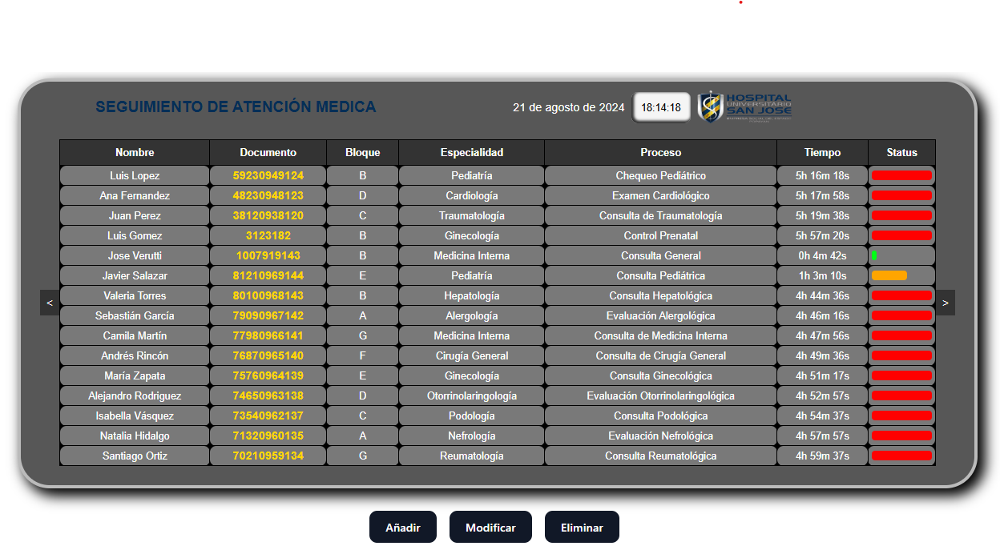

# App gestion hospitalaria de pacientes 

 

## Descripción

Esta es una aplicación desarrollada en React que se encarga de mostrar los pacientes de un hospital, su ubicación y tiempo. La aplicación se conecta a una API que gestiona los datos de los pacientes, incluyendo:

- **Creación**: Añadir nuevos pacientes al sistema.
- **Modificación**: Actualizar la información existente de los pacientes.
- **Eliminación**: Borrar pacientes del sistema.

La aplicación proporciona una interfaz intuitiva para visualizar y manejar la información de los pacientes, facilitando la administración y seguimiento en el entorno hospitalario.

## Características

- Visualización de datos de pacientes.
- Información detallada sobre ubicación y tiempo.
- Conexión con una API para la gestión de datos.
