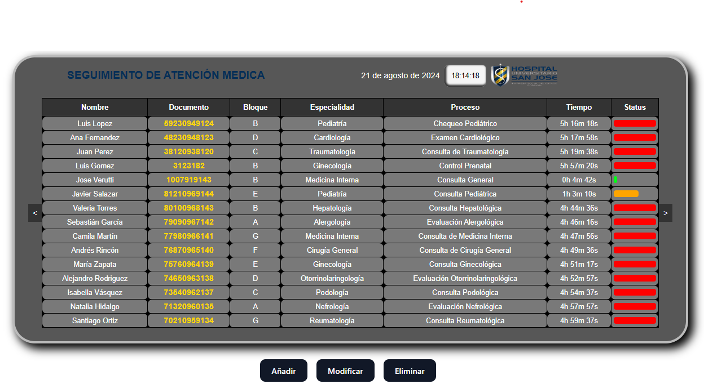

Aquí tienes el readme correctamente formateado:

# App gestión hospitalaria de pacientes


## Descripción
Esta es una aplicación desarrollada en React que se encarga de mostrar los pacientes de un hospital, su ubicación y tiempo. La aplicación se conecta a una API que gestiona los datos de los pacientes, incluyendo:

- **Creación**: Añadir nuevos pacientes al sistema.
- **Modificación**: Actualizar la información existente de los pacientes.
- **Eliminación**: Borrar pacientes del sistema.

La aplicación proporciona una interfaz intuitiva para visualizar y manejar la información de los pacientes, facilitando la administración y seguimiento en el entorno hospitalario.

## Características
- Visualización de datos de pacientes.
- Información detallada sobre ubicación y tiempo.
- Conexión con una API para la gestión de datos.

## Instalación

### Requisitos previos
Antes de instalar el frontend, asegúrate de que el backend esté correctamente instalado y ejecutándose en local en el puerto 8000. El backend se encuentra en el repositorio [PruebaTecnicaHospital](URL_DEL_REPOSITORIO_BACKEND).

### Pasos para la instalación

1. **Clonar el repositorio del frontend**
   Clona este repositorio en tu máquina local utilizando Git:
   ```bash
   git clone <URL_DEL_REPOSITORIO_FRONTEND>
   ```

2. **Navegar al directorio del proyecto**
   Accede al directorio del proyecto clonado:
   ```bash
   cd <DIRECTORIO_DEL_PROYECTO>
   ```

3. **Instalar dependencias**
   Asegúrate de tener Node.js y npm instalados. Luego, instala las dependencias del proyecto:
   ```bash
   npm install
   ```

4. **Configurar la conexión con el backend**
   Asegúrate de que la URL del backend en el proyecto React esté correctamente configurada para apuntar a `http://localhost:8000`. Puedes verificar o ajustar esta configuración en el archivo de configuración correspondiente.

5. **Iniciar el servidor de desarrollo**
   Ejecuta el siguiente comando para iniciar el servidor de desarrollo de React:
   ```bash
   npm start
   ```
   Esto abrirá la aplicación en tu navegador predeterminado. Si no se abre automáticamente, visita `http://localhost:3000` en tu navegador.

6. **Verificar el funcionamiento**
   Asegúrate de que la aplicación frontend esté correctamente conectada al backend y que puedas realizar operaciones como la creación, modificación y eliminación de pacientes.
